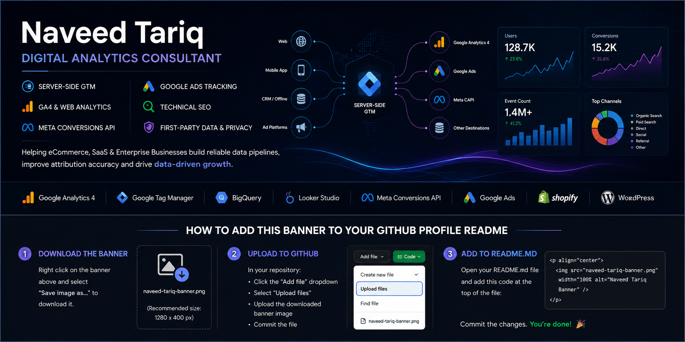

  

<h1 align="center">Hi 👋 I'm Naveed Tariq</h1>
<h3 align="center">
Founder of <strong>Twebz</strong> • Digital Analytics Consultant • Server-side GTM Specialist
</h3>

Helping eCommerce, SaaS and enterprise businesses build accurate analytics systems through Server-side GTM, GA4, Meta Conversions API, Google Ads Tracking and Technical SEO.

## 🚀 What I Build

I help businesses fix broken tracking, improve attribution and build reliable first-party analytics systems.

- ✅ Server-side GTM
- ✅ Google Analytics 4 (GA4)
- ✅ Meta Conversions API (CAPI)
- ✅ Google Ads Conversion Tracking
- ✅ Technical SEO
- ✅ Shopify SEO
- ✅ WordPress SEO
- ✅ Analytics Audits
- ✅ Consent Mode v2
- ✅ First-party Data Pipelines

---

## 🏆 Proof Points

  
  
  
  

- 🌍 Clients across **UK, Netherlands, Finland & UAE**
- ⚡ **1.4M+ events** tracked and reconciled across client accounts
- 🚀 **710% verified purchase-conversion lift** from a full server-side tracking rebuild

---

## 🛠 Tech Stack

  

**Analytics & Tracking:** GA4 • GTM • BigQuery • Looker Studio • Amplitude • Mixpanel • PostHog • Hotjar • Microsoft Clarity • Supermetrics • Stape • Taggrs • Tracklution • HubSpot • Zoho

---

## 👨‍💻 About Me

Hi, I'm **Naveed Tariq**, Founder of **Twebz** and a Digital Analytics Consultant with **5+ years of experience** helping eCommerce, SaaS, and enterprise businesses build reliable analytics and measurement systems.

I specialize in **Server-side Google Tag Manager (sGTM), Google Analytics 4 (GA4), Meta Conversions API (CAPI), Google Ads Conversion Tracking, and Technical SEO**.

My focus is helping businesses improve attribution accuracy, recover lost conversion data, and build privacy-first analytics infrastructure that supports smarter marketing decisions.

I've worked with clients across the **UK, Netherlands, Finland, UAE**, and other international markets.
---

## 💼 Services

- Server-side Google Tag Manager (sGTM)
- Google Analytics 4 (GA4)
- Meta Conversions API (CAPI)
- Google Ads Conversion Tracking
- Technical SEO
- SEO Audits
- Shopify SEO
- WordPress SEO
- Analytics Audits
- Consent Mode v2
- First-party Data Strategy
---

## 📈 Case Studies

🏆 710% verified purchase conversion lift after rebuilding a complete server-side tracking infrastructure.

📊 Processed and validated over **1.4M+ analytics events**.

🌍 Delivered analytics solutions for clients across **UK, Netherlands, Finland, and UAE**.

🎯 Managed tracking for **50+ Google Ads accounts**.

📈 Achieved **590+ Top-10 keyword rankings** across **100+ websites**.
---

## 🤝 Who I Work With

✔ eCommerce Brands

✔ SaaS Companies

✔ Marketing Agencies

✔ Shopify Stores

✔ WordPress Businesses

✔ Startups

✔ Enterprise Businesses
---

## 🛠 Analytics & Marketing Tools

Google Tag Manager • Google Analytics 4 • BigQuery • Looker Studio • Stape • Taggrs • Tracklution • Microsoft Clarity • Hotjar • Mixpanel • Amplitude • PostHog • HubSpot • Zoho • Supermetrics
---

## 🚀 Featured Projects

Coming Soon...

- Digital Analytics Playbook
- Server-side GTM Guide
- GA4 Tracking Templates
- Technical SEO Checklist
---

## 📊 GitHub Stats

  
  

  

## 📫 Let's Connect

  <a href="https://twebz.com">🌐 Website</a> •
  <a href="https://www.linkedin.com/in/naveed-tariq-web-tracking-and-analytics-specialist/">LinkedIn</a> •
  <a href="https://www.behance.net/gallery/244354475/Web-Analytics-and-Tracking-Portfolio">Behance</a> •
  <a href="https://thenaveedtariq.medium.com/">Medium</a> •
  <a href="https://x.com/thenaveedtariq">X</a> •
  <a href="https://www.instagram.com/naveed.tariqofficial/">Instagram</a>

